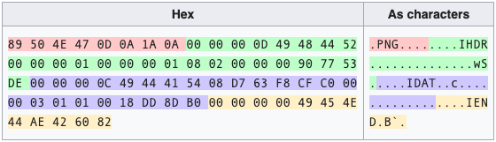

# Forensics: Basics of PNG Forensics

Here is a list of things that I would look at if the Forensics challenge involves a png file. 
Note that it is not necassary at all for the solution to be hidden in any of the following steps cuz every ctf I learn something new, but these are the basic things that come to my mind.

Also the following are just for the sake of documentation and sort of like a guide to the basics that I have learnt and still am.

 I dont think its easy to learn basics by just going through these writeup once, but I sure do hope it helps with ctfs.


## Overview:
Whenever a challenge in Forensics/Stego category involves a png the very first things to look at are:
1. is it even a png file?
2. there must be some kinda plain text hidden amidst the binary data maybe?
3. wonder if the meta data has any info for me...
4. hmm... is there a hidden file in the png... probably another png itself?
5. what about the different layers of the image? Like green, blue and red...? 

## A PNG File:
the linux command `file` is a very useful tool and tells us a lot about the file. It also gives additional information on image dimenssions and any added extra comments.
```
file <filename>
```
>Note: file signature usually contain ascii printable text too to make it easy for users/readers to identify. So for a png file you can see `PNG` in the initial bytes of the file's binary data, similarly for a JPEG you might wanna look out for `jfif`, for a zip, that'll be `PK` which are the initials of the great mind who developed zip format, Phil Katz.

This should tell you whether the given image is a png or anything else. Usually if the challenge gives you a png with a different file signature then the file command just says its plain data.
A PNG file is broken down into different standard parts called `chunks`. There are specific types of chunks that are a must for any png file.
They are:
|            Chunk.....          |                       ... and its significance                 |
|---------------------------|-----------------------------------------------------|
|       PNG file header     |         tells the system "yes i am a png file"       |
|               IHDR              |        contains info on image - 'size, depth'       |
|               IDAT               |  contains info on the images - 'pixel values'    |
|               IEND              |                           end of a png file                      |
These chunks along with another chunk called `PLTE` are called `Critical Chunks`
There are other chunks too that are not necessary for a PNG, which are called `Ancillary Chunks`

Each of these chunks (other than file signature. It isn't a chunk exactly) are again broken down into 4 parts:
|   Chunk Length    |   Chunk Type  |   Check data  |   CRC   |
1. Chunk Length: It tells the system while reading the png file that the next following 'x' bytes are going to be for this particular chunk.
2. Chunk Type: tells us which chunk it is.
3. Chunk data: contains all the data for the particular chunk.
4. CRC: This has always been a tricky part for me. but to generalise this field i could say that based on a formula the chunk's data is calculated and stored. Its really complicated for me but its like a way to check that the whole chunk has no loss or sorruption of data. so if the chunk's data is read and calculated by the system its checks if its all fine with CRC values
>I'll try explaining this a little more later on. :)

If you want to learn all about a PNG file and its structure this [wiki link](https://en.wikipedia.org/wiki/Portable_Network_Graphics) is perfect to help you with it, and if its not good enough we always have google baba for the job...


## Strings and metadata:
The Linux command `strings` prints all the ascii printable data from any file's rawdata and trims anything that isn't printable.
```
strings <filename>
```
if the output is way too big:
```
strings <filename> | less
```
Hints or sometimes the flag itself are hidden as plain printable text or any for of ecrupted text sometimes.
Also by viewing all the printable text you will also be able to look out for anything funny, Like probably another file signature would suggest a hidden file sitting right there, and you could take further action to verify if you are on the right path.
Additionally, look out for strings like 'PNG', 'iHDR', 'iDAT', 'IEND' and so on to make sure you are handling a png file.

Metadata, as the name suggests is a gist of data on the larger data being handled, which is in this case a png file data.
When you take a picture on your phone or camera various bits of information like time, date, location, image type and version, size, colour code, depth, author, title, comments and so on are hardwired into the PNG and then saved. It is common to see ctf organisers to hide some kind of hint or in some cases the flag itself in the metadata.
Linux tool `exiftool` helps us view metadata of most of the files available.
```
exiftool <filename>
```

Zsteg is another interesting tool that prints out anything out of the box for a png file.
```
zsteg <filename>
```
It can print out some ascii text or file extension it detects that you might have missed earlier.
Sometimes you get a message in the image metadata saying "Minor error, ascii text found at so and so location", you can use zsteg and it might be able to print it out if there is anything.


## Hexdump:
most forensics challenges involving viewing the raw data in the file to understand what you are actually dealing with.
But the raw data cannot be printed out. That is why we use hexdump, a method to dump or output the raw data of a file in the form of hex numbers as raw data can be represented in the form of hexadecimal numbers.
>Want to know about hexadecimal number system? check out [this](https://www.tutorialspoint.com/hexadecimal-number-system) link right here

The linux tool xxd does this job:
```
xxd <filename>
```
If you want you could also use any gui based hex editor, my favourite being `ghex`
```
ghex <filename>
```

If the file is not being recognised as a png you might wanna look into the initial 8 bytes using a hexeditor, which must have the png file header to be able to view it.
PNG file header has the following hex values:
`89 50 4e 47 0d 0a 1a 0a`
The next 4 bytes generally, are  `00 00 00 0d` which is basically the start of IHDR chunk.

##### The IHDR chunk:
No matter what INDR chunk has to be after the file header, with no other chunk in between.
Like all chunks, the IHDR chunk can be broken down into 4 parts (like mentioned earlier):
1. Chunk length
2. Chunk Type
3. Chunk data
4. CRC

the chunk length for me has always been (more like i havnt noticed anyother value) of the following hex values: `00 00 00 0d`
which in decimal is `13`. So here the IHDR Chunk is telling the system "Hey, the next 14 bytes that you will be reading are all about me!"
>Note that i used 14 cuz counting in binary machines starts from 0, so 0 to 13 makes 14 bytes.

Note that CRC is not involved here. so the IHDR chunk length gives the amount of bytes that chunk Type and Chunk Data together makeup.
For IHDR the chunk Type must be `49 48 44 52` which is, as a matter of fact, ascii printable and converts to text to read as `IHDR`.
The chunk data  is 10 bytes long, the first 8 bytes are for the image size, the next byte for image depth and the last one for the image color code.
followed by a 5 byte CRC data

here is an example of IHDR chunk for an image of size 300x150 (CRC is just for example): 
`00 00 00 0d 49 48 44 52 00 00 01 2c 00 00 00 96 08 02 5e c3 ba 89 f4`

Chunk Length - `00 00 00 0d`

Chunk Type - `49 48 44 52`

Chunk Data- `00 00 01 2c 00 00 00 96 08 02`

CRC- `5e c3 ba 89 f4`

##### The IDAT chunk:
This is where all the information on the image is stored. The whole image data might be spread out across multiple IDAT chunks, but for a PNG a minimum of 1 IDAT chunk is a must.

##### The IEND chunk:
This chunk marks the end of a PNG file. IEND chunk has 0 bytes of chunk data in it. So it just acts like a End Of File for the system while reading the PNG.
The IEND chunk looks like this in hexadecimal format:
`00 00 00 00 49 45 4E 44 AE 42 60 82`

Here is an example from PNG wiki (link mentioned earlier)

This is the hex dump of a PNG file for one single red pixel as the image.


Often they give corrupted images, which have a missing chunk header, or a missing file header or any of these. Such modifications might show up as a `CRC Error` or any other file error. You can manually correct them with the help of any PNG wiki page.

Or you could try this tool called [PCRT](https://github.com/sherlly/PCRT)


## Hidden files:
You can look at the hex values in the file and find files. These files can be extracted with the linux `dd`:
```
$ dd if=<input_filename> of=<output_filename> bs=1 skip=<offset> count=<byte_length_of_hidden_file>
```
now you can use this only when you know the offset from which the hidden file starts. You can get this from `xxd` hexdump too.  
Another Linux tool `binwalk` is a litlle more useful in quite a few situations.
this command atomatically scans the file for any other file in it:
```
binwalk <filename>
```

this can be used to scan as well as extract any known file signature:
```
binwalk -ec <filename>
```

Or you canextract every single file with:
```
binwalk -dd=".*"
```

if you want to extract a prticular file, say png:
```
binwalk -dd="png image:png"
```

## Hidden data in different layers:
It is possible to hide some kind of data in the form of layers. 
A PNG file can have many layers but they need not have any interesting data in them.
But it is always good to check.
This tool called [stegsolve](https://github.com/Giotino/stegsolve) is a really good tool to view multiple layers. This tool also allows you to save any layer you find has some interesting content.


### Thats It Folks...
This is all i have for now. if ive gone wrong anywhere, please do correct me!
HAPPY HACKING!
